# Entity-Relationship Diagram (ERD) for Al-Rehla Platform

This document provides a visual representation of the database schema for the Al-Rehla platform.

**Legend:**
- `PK`: Primary Key
- `FK`: Foreign Key

---

```mermaid
erDiagram
    users {
        CHAR_36_ id PK "UUID"
        VARCHAR_255_ name
        VARCHAR_255_ email
        ENUM role
        TIMESTAMP updated_at
        TIMESTAMP deleted_at "Nullable"
    }

    child_profiles {
        CHAR_36_ id PK "UUID"
        CHAR_36_ user_id FK "Parent's User ID"
        VARCHAR_255_ name
        DATE birth_date
        CHAR_36_ student_user_id FK "Student's User ID (nullable, unique)"
    }

    instructors {
        CHAR_36_ id PK "UUID"
        CHAR_36_ user_id FK "Instructor's User ID (nullable, unique)"
        VARCHAR_255_ name
        VARCHAR_255_ specialty
        JSON weekly_schedule
        JSON package_rates
        JSON service_rates
        DECIMAL rate_per_session
    }
    
    site_settings {
        VARCHAR_255_ key PK "Configuration Key"
        JSON value "Dynamic Config Object"
        TIMESTAMP updated_at
    }

    audit_logs {
        CHAR_36_ id PK "UUID"
        CHAR_36_ user_id FK "Nullable (System Actions)"
        VARCHAR_255_ action
        VARCHAR_255_ target_description
        TEXT details
        TIMESTAMP timestamp
    }

    instructor_payouts {
        CHAR_36_ id PK "UUID"
        CHAR_36_ instructor_id FK
        DECIMAL amount
        DATE payout_date
        TEXT details
    }

    orders {
        CHAR_36_ id PK "UUID"
        CHAR_36_ user_id FK
        CHAR_36_ child_id FK
        DECIMAL total
        ENUM status
    }

    bookings {
        CHAR_36_ id PK "UUID"
        CHAR_36_ user_id FK
        CHAR_36_ child_id FK
        CHAR_36_ instructor_id FK
        DECIMAL total
        ENUM status
    }
    
    subscriptions {
        CHAR_36_ id PK "UUID"
        CHAR_36_ user_id FK
        CHAR_36_ child_id FK
        ENUM status
    }

    service_orders {
        CHAR_36_ id PK "UUID"
        CHAR_36_ user_id FK
        CHAR_36_ child_id FK
        CHAR_36_ service_id FK
        CHAR_36_ assigned_instructor_id FK "Nullable"
        ENUM status
    }

    standalone_services {
        CHAR_36_ id PK "UUID"
        VARCHAR_255_ name
        DECIMAL price
        ENUM provider_type "company | instructor"
    }

    scheduled_sessions {
        CHAR_36_ id PK "UUID"
        CHAR_36_ booking_id FK "Nullable"
        CHAR_36_ subscription_id FK "Nullable"
        CHAR_36_ child_id FK
        CHAR_36_ instructor_id FK
        ENUM status
    }

    badges {
        CHAR_36_ id PK "UUID"
        VARCHAR_255_ name
    }

    child_badges {
        CHAR_36_ id PK "UUID"
        CHAR_36_ child_id FK
        CHAR_36_ badge_id FK
    }

    blog_posts {
        CHAR_36_ id PK "UUID"
        VARCHAR_255_ title
        TEXT content
    }

    support_tickets {
        CHAR_36_ id PK "UUID"
        VARCHAR_255_ name
        VARCHAR_255_ email
        ENUM status
    }

    join_requests {
        CHAR_36_ id PK "UUID"
        VARCHAR_255_ name
        VARCHAR_255_ email
        ENUM status
    }
    
    session_messages {
        CHAR_36_ id PK "UUID"
        CHAR_36_ booking_id FK
        CHAR_36_ sender_id FK
        TEXT message_text
    }
    
    session_attachments {
        CHAR_36_ id PK "UUID"
        CHAR_36_ booking_id FK
        CHAR_36_ uploader_id FK
        VARCHAR_255_ file_url
    }

    %% --- Relationships ---
    
    users ||--o{ child_profiles : "has (parent)"
    users }o..|| child_profiles : "is (student)"
    users }o..|| instructors : "is (instructor)"
    
    instructors ||--o{ instructor_payouts : "receives"
    
    users ||--o{ orders : "places"
    child_profiles ||--o{ orders : "is for"
    
    users ||--o{ subscriptions : "subscribes"
    child_profiles ||--o{ subscriptions : "is for"
    
    users ||--o{ bookings : "books"
    child_profiles ||--o{ bookings : "is for"
    instructors ||--o{ bookings : "is assigned to"
    
    users ||--o{ service_orders : "orders"
    child_profiles ||--o{ service_orders : "is for"
    standalone_services ||--o{ service_orders : "is ordered"
    instructors }o--o{ service_orders : "is assigned to"
    
    bookings ||--o{ scheduled_sessions : "consists of"
    subscriptions ||--o{ scheduled_sessions : "includes"
    instructors ||--o{ scheduled_sessions : "conducts"
    child_profiles ||--o{ scheduled_sessions : "attends"
    
    child_profiles }o--o{ child_badges : "earns"
    badges ||--o{ child_badges : "is earned by"
    
    bookings ||--o{ session_messages : "has"
    bookings ||--o{ session_attachments : "has"
```

