# Entity-Relationship Diagram (ERD) for Al-Rehla Platform

This document provides a visual representation of the database schema for the Al-Rehla platform. It illustrates the primary entities (tables), their key attributes, and the relationships connecting them.

**Legend:**
- `PK`: Primary Key
- `FK`: Foreign Key
- `|o--o{`: One-to-Many relationship
- `}o--o|`: One-to-One relationship

---

```mermaid
erDiagram
    users {
        VARCHAR_255_ id PK "UUID"
        VARCHAR_255_ name
        VARCHAR_255_ email
        ENUM role
    }

    child_profiles {
        INT id PK "Auto-increment"
        VARCHAR_255_ user_id FK "Parent's User ID"
        VARCHAR_255_ name
        DATE birth_date
        VARCHAR_255_ student_user_id FK "Student's User ID (nullable, unique)"
    }

    instructors {
        INT id PK "Auto-increment"
        VARCHAR_255_ user_id FK "Instructor's User ID (nullable, unique)"
        VARCHAR_255_ name
        VARCHAR_255_ specialty
        JSON weekly_schedule
    }

    orders {
        VARCHAR_255_ id PK
        VARCHAR_255_ user_id FK
        INT child_id FK
        DECIMAL total
        ENUM status
    }

    creative_writing_bookings {
        VARCHAR_255_ id PK
        VARCHAR_255_ user_id FK
        INT child_id FK
        INT instructor_id FK
        DECIMAL total
        ENUM status
    }
    
    subscriptions {
        VARCHAR_255_ id PK
        VARCHAR_255_ user_id FK
        INT child_id FK
        ENUM status
    }

    service_orders {
        VARCHAR_255_ id PK
        VARCHAR_255_ user_id FK
        INT child_id FK
        INT service_id FK
        INT assigned_instructor_id FK "Nullable"
        ENUM status
    }

    standalone_services {
        INT id PK
        VARCHAR_255_ name
        DECIMAL price
    }

    scheduled_sessions {
        VARCHAR_255_ id PK
        VARCHAR_255_ booking_id FK "Nullable"
        VARCHAR_255_ subscription_id FK "Nullable"
        INT child_id FK
        INT instructor_id FK
        ENUM status
    }

    badges {
        INT id PK
        VARCHAR_255_ name
    }

    child_badges {
        INT id PK
        INT child_id FK
        INT badge_id FK
    }

    blog_posts {
        INT id PK
        VARCHAR_255_ title
        TEXT content
    }

    support_tickets {
        VARCHAR_255_ id PK
        VARCHAR_255_ name
        VARCHAR_255_ email
    }

    join_requests {
        VARCHAR_255_ id PK
        VARCHAR_255_ name
        VARCHAR_255_ email
    }
    
    session_messages {
        VARCHAR_255_ id PK
        VARCHAR_255_ booking_id FK
        VARCHAR_255_ sender_id FK
        TEXT message_text
    }
    
    session_attachments {
        VARCHAR_255_ id PK
        VARCHAR_255_ booking_id FK
        VARCHAR_255_ uploader_id FK
        VARCHAR_255_ file_url
    }

    %% --- Relationships ---
    
    %% Core User & Profile Relationships
    users ||--o{ child_profiles : "has (parent)"
    users }o..|| child_profiles : "is (student)"
    users }o..|| instructors : "is (instructor)"
    
    %% "Enha Lak" Relationships
    users ||--o{ orders : "places"
    child_profiles ||--o{ orders : "is for"
    
    users ||--o{ subscriptions : "subscribes"
    child_profiles ||--o{ subscriptions : "is for"
    
    %% "Creative Writing" Relationships
    users ||--o{ creative_writing_bookings : "books"
    child_profiles ||--o{ creative_writing_bookings : "is for"
    instructors ||--o{ creative_writing_bookings : "is assigned to"
    
    users ||--o{ service_orders : "orders"
    child_profiles ||--o{ service_orders : "is for"
    standalone_services ||--o{ service_orders : "is ordered"
    instructors }o--o{ service_orders : "is assigned to"
    
    %% Session Relationships
    creative_writing_bookings ||--o{ scheduled_sessions : "consists of"
    subscriptions ||--o{ scheduled_sessions : "includes"
    instructors ||--o{ scheduled_sessions : "conducts"
    child_profiles ||--o{ scheduled_sessions : "attends"
    
    %% Gamification
    child_profiles }o--o{ child_badges : "earns"
    badges ||--o{ child_badges : "is earned by"
    
    %% Journey Workspace Relationships
    creative_writing_bookings ||--o{ session_messages : "has"
    creative_writing_bookings ||--o{ session_attachments : "has"
    users ||--o{ session_messages : "sends"
    users ||--o{ session_attachments : "uploads"
```

